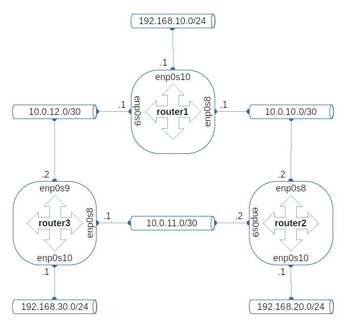

# Домашнее задание 21. OSPF.
1. Поднять три виртуалки
2. Объединить их разными vlan
  - поднять OSPF между машинами на базе Quagga;
  - изобразить ассиметричный роутинг;
  - сделать один из линков "дорогим", но что бы при этом роутинг был симметричным. Формат сдачи: Vagrantfile + ansible
## Выполнение
1. Поднять три виртуалки
  - Клонируем репо
  ```
  git clone https://github.com/linuxprolab/hw21.ospf
  ```
  - Поднимаем виртуалки:
  ```
  vagrant up
  ```
  - Получаем три роутера, сконфигуренные по схеме:
  
  - Смотрим таблицы маршрутизации роутеров
```
router1# show ip ro ospf
Codes: K - kernel route, C - connected, S - static, R - RIP,
       O - OSPF, I - IS-IS, B - BGP, E - EIGRP, N - NHRP,
       T - Table, v - VNC, V - VNC-Direct, A - Babel, F - PBR,
       f - OpenFabric,
       > - selected route, * - FIB route, q - queued, r - rejected, b - backup
       t - trapped, o - offload failure

O   10.0.10.0/30 [110/100] is directly connected, enp0s8, weight 1, 00:08:25
O>* 10.0.11.0/30 [110/200] via 10.0.10.2, enp0s8, weight 1, 00:07:19
  *                        via 10.0.12.2, enp0s9, weight 1, 00:07:19
O   10.0.12.0/30 [110/100] is directly connected, enp0s9, weight 1, 00:08:25
O   192.168.10.0/24 [110/100] is directly connected, enp0s10, weight 1, 00:08:25
O>* 192.168.20.0/24 [110/200] via 10.0.10.2, enp0s8, weight 1, 00:07:36
O>* 192.168.30.0/24 [110/200] via 10.0.12.2, enp0s9, weight 1, 00:07:19

```
```
router2# show ip ro ospf
Codes: K - kernel route, C - connected, S - static, R - RIP,
       O - OSPF, I - IS-IS, B - BGP, E - EIGRP, N - NHRP,
       T - Table, v - VNC, V - VNC-Direct, A - Babel, F - PBR,
       f - OpenFabric,
       > - selected route, * - FIB route, q - queued, r - rejected, b - backup
       t - trapped, o - offload failure

O   10.0.10.0/30 [110/100] is directly connected, enp0s8, weight 1, 00:09:18
O   10.0.11.0/30 [110/100] is directly connected, enp0s9, weight 1, 00:09:18
O>* 10.0.12.0/30 [110/200] via 10.0.10.1, enp0s8, weight 1, 00:08:22
  *                        via 10.0.11.1, enp0s9, weight 1, 00:08:22
O>* 192.168.10.0/24 [110/200] via 10.0.10.1, enp0s8, weight 1, 00:08:43
O   192.168.20.0/24 [110/100] is directly connected, enp0s10, weight 1, 00:09:18
O>* 192.168.30.0/24 [110/200] via 10.0.11.1, enp0s9, weight 1, 00:08:22

```
```
router3# show ip ro ospf
Codes: K - kernel route, C - connected, S - static, R - RIP,
       O - OSPF, I - IS-IS, B - BGP, E - EIGRP, N - NHRP,
       T - Table, v - VNC, V - VNC-Direct, A - Babel, F - PBR,
       f - OpenFabric,
       > - selected route, * - FIB route, q - queued, r - rejected, b - backup
       t - trapped, o - offload failure

O>* 10.0.10.0/30 [110/200] via 10.0.11.2, enp0s8, weight 1, 00:09:04
  *                        via 10.0.12.1, enp0s9, weight 1, 00:09:04
O   10.0.11.0/30 [110/100] is directly connected, enp0s8, weight 1, 00:09:39
O   10.0.12.0/30 [110/100] is directly connected, enp0s9, weight 1, 00:09:09
O>* 192.168.10.0/24 [110/200] via 10.0.12.1, enp0s9, weight 1, 00:09:04
O>* 192.168.20.0/24 [110/200] via 10.0.11.2, enp0s8, weight 1, 00:09:04
O   192.168.30.0/24 [110/100] is directly connected, enp0s10, weight 1, 00:09:39

```
2. Изобразить ассиметричный роутинг
  - На всех виртуалках выполнить команду 
  ```
  sysctl net.ipv4.conf.all.rp_filter=0
  ```
  - На `router1` меняем стоимость интерфейса `enp0s8`
  ```
  router1# conf t
  router1(config)# int enp0s8
  router1(config-if)# ip ospf cost 1000
  router1(config-if)# exit
  router1(config)# exit
  router1# show ip route ospf
  Codes: K - kernel route, C - connected, S - static, R - RIP,
         O - OSPF, I - IS-IS, B - BGP, E - EIGRP, N - NHRP,
         T - Table, v - VNC, V - VNC-Direct, A - Babel, F - PBR,
         f - OpenFabric,
         > - selected route, * - FIB route, q - queued, r - rejected, b - backup
         t - trapped, o - offload failure

  O   10.0.10.0/30 [110/300] via 10.0.12.2, enp0s9, weight 1, 00:00:10
  O>* 10.0.11.0/30 [110/200] via 10.0.12.2, enp0s9, weight 1, 00:00:10
  O   10.0.12.0/30 [110/100] is directly connected, enp0s9, weight 1, 00:11:21
  O   192.168.10.0/24 [110/100] is directly connected, enp0s10, weight 1, 00:11:21
  O>* 192.168.20.0/24 [110/300] via 10.0.12.2, enp0s9, weight 1, 00:00:10
  O>* 192.168.30.0/24 [110/200] via 10.0.12.2, enp0s9, weight 1, 00:10:15

  ```
  - На `router2` смотрим таблицу маршртутизации
  ```
  router2# show ip ro ospf
  Codes: K - kernel route, C - connected, S - static, R - RIP,
         O - OSPF, I - IS-IS, B - BGP, E - EIGRP, N - NHRP,
         T - Table, v - VNC, V - VNC-Direct, A - Babel, F - PBR,
         f - OpenFabric,
         > - selected route, * - FIB route, q - queued, r - rejected, b - backup
         t - trapped, o - offload failure

  O   10.0.10.0/30 [110/100] is directly connected, enp0s8, weight 1, 00:12:06
  O   10.0.11.0/30 [110/100] is directly connected, enp0s9, weight 1, 00:12:06
  O>* 10.0.12.0/30 [110/200] via 10.0.10.1, enp0s8, weight 1, 00:11:10
    *                        via 10.0.11.1, enp0s9, weight 1, 00:11:10
  O>* 192.168.10.0/24 [110/200] via 10.0.10.1, enp0s8, weight 1, 00:11:31
  O   192.168.20.0/24 [110/100] is directly connected, enp0s10, weight 1, 00:12:06
  O>* 192.168.30.0/24 [110/200] via 10.0.11.1, enp0s9, weight 1, 00:11:10

  ```
  - На `router1` запускаем пинг
  ```
  ping -I 192.168.10.1 192.168.20.1
  ```
  - На `router2` cмотрим `tcpdump` на интерфейсе `enp0s9`. Видим только ICMP ответы от `router2`.
  ```
root@router2:/home/vagrant#  tcpdump -i enp0s9
tcpdump: verbose output suppressed, use -v or -vv for full protocol decode
listening on enp0s9, link-type EN10MB (Ethernet), capture size 262144 bytes
16:55:08.778001 IP router2 > ospf-all.mcast.net: OSPFv2, Hello, length 48
16:55:08.923515 IP 192.168.10.1 > router2: ICMP echo request, id 1, seq 47, length 64
16:55:09.926251 IP 192.168.10.1 > router2: ICMP echo request, id 1, seq 48, length 64
16:55:10.927772 IP 192.168.10.1 > router2: ICMP echo request, id 1, seq 49, length 64
16:55:11.929126 IP 192.168.10.1 > router2: ICMP echo request, id 1, seq 50, length 64
16:55:12.930215 IP 192.168.10.1 > router2: ICMP echo request, id 1, seq 51, length 64
  ```
3. Изобразить ссиметричный роутинг
- На `router2` меняем стоимость интерфейса `enp0s8`
```
router2# conf t
router2(config)# int enp0s8
router2(config-if)# ip ospf cost 1000
router2(config-if)# exit
router2(config)# exit
router2# 

```
- Теперь у нас оба линка дорогие, но трафик при этом симметричный 
```
router2# show ip ro ospf
Codes: K - kernel route, C - connected, S - static, R - RIP,
       O - OSPF, I - IS-IS, B - BGP, E - EIGRP, N - NHRP,
       T - Table, v - VNC, V - VNC-Direct, A - Babel, F - PBR,
       f - OpenFabric,
       > - selected route, * - FIB route, q - queued, r - rejected, b - backup
       t - trapped, o - offload failure

O   10.0.10.0/30 [110/1000] is directly connected, enp0s8, weight 1, 00:01:36
O   10.0.11.0/30 [110/100] is directly connected, enp0s9, weight 1, 00:17:34
O>* 10.0.12.0/30 [110/200] via 10.0.11.1, enp0s9, weight 1, 00:01:36
O>* 192.168.10.0/24 [110/300] via 10.0.11.1, enp0s9, weight 1, 00:01:36
O   192.168.20.0/24 [110/100] is directly connected, enp0s10, weight 1, 00:17:34
O>* 192.168.30.0/24 [110/200] via 10.0.11.1, enp0s9, weight 1, 00:16:38

```
- Смотрим `tcpdump` на интерфейсе `enp0s9`. Видим и ICMP запросы и ICMP ответы.
```
root@router2:/home/vagrant# tcpdump -i enp0s9
tcpdump: verbose output suppressed, use -v or -vv for full protocol decode
listening on enp0s9, link-type EN10MB (Ethernet), capture size 262144 bytes
16:58:10.020495 IP 192.168.10.1 > router2: ICMP echo request, id 1, seq 225, length 64
16:58:10.020566 IP router2 > 192.168.10.1: ICMP echo reply, id 1, seq 225, length 64
16:58:11.021403 IP 192.168.10.1 > router2: ICMP echo request, id 1, seq 226, length 64
16:58:11.021470 IP router2 > 192.168.10.1: ICMP echo reply, id 1, seq 226, length 64
16:58:12.021212 IP 192.168.10.1 > router2: ICMP echo request, id 1, seq 227, length 64
16:58:12.021250 IP router2 > 192.168.10.1: ICMP echo reply, id 1, seq 227, length 64

```